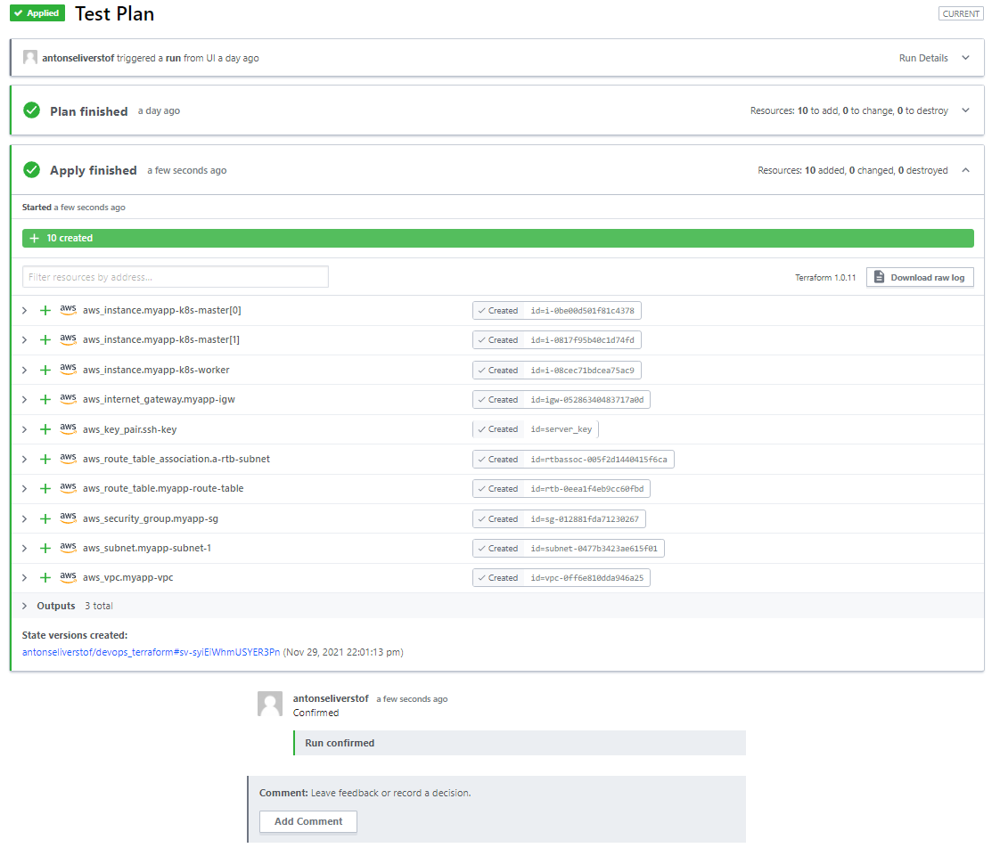
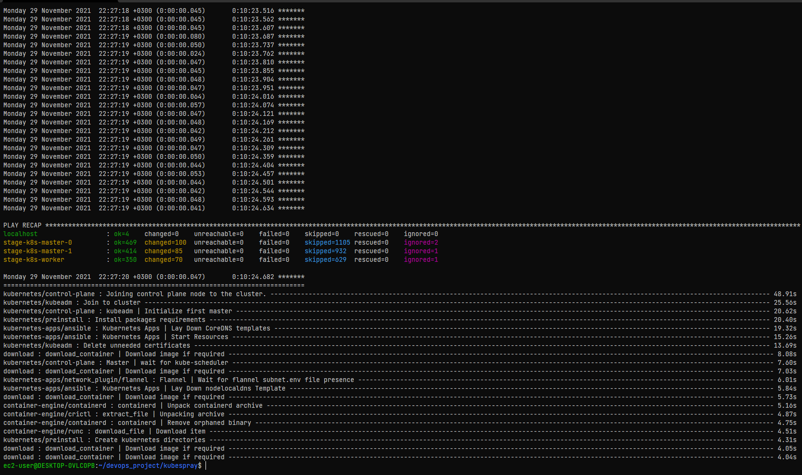
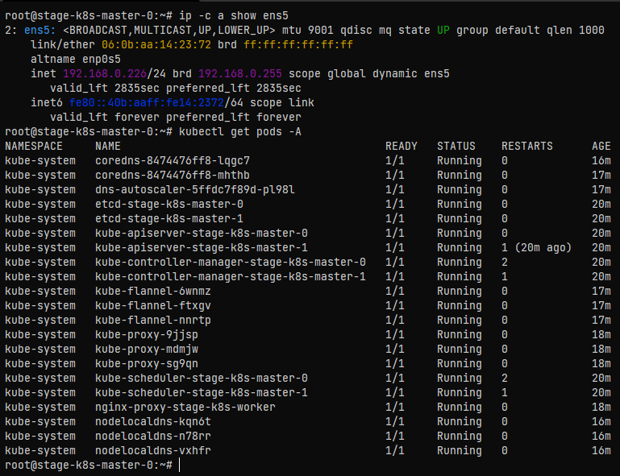

## Devops Project

### 1. AWS Infrastructure with Terraform  
Конфигурационные файлы **Terraform**:
```
https://github.com/antonseliverstof/devops_terraform
```  
В качестве бекэнда используется **Terraform Cloud**:  
  
*Примененная конфигурация*:  
  
### 2. Kubernetes Cluster  
Кластер **Kubernetes** создан при помощи **Kubespray**:
```  
https://github.com/antonseliverstof/devops-kubespray  
```  
*Установка k8s*   
  
*Список Подов кластера*:  
  

### 3. Simple Test App  
```
https://gitlab.com/antonseliverstof/devops-test-app  
https://hub.docker.com/repository/docker/antonseliverstof/devops-test-app
```
В репозитории Gitlab находятся:
- Простое тестовое приложение **index.html**  
- Конфигурационный файл **Nginx.conf**  
- **Dockerfile** для сборки образа  

В репозитории Dockerhub:
- Готовые образы приложения  

Сборка образа и его загрузка в репозиторий происходят автоматически при коммите в ветку Main или добавлении Тэга.  

CI реализован на базе **Gitlab CI**  
  
  

### 4. Конфигурация k8s  
Организация мониторинга выполнена с помощью установки [kube-prometheus](https://github.com/prometheus-operator/kube-prometheus)  

*Веб-интерфейс **Grafana** доступен по адресу*:  
http://13.49.78.171:32183/  
